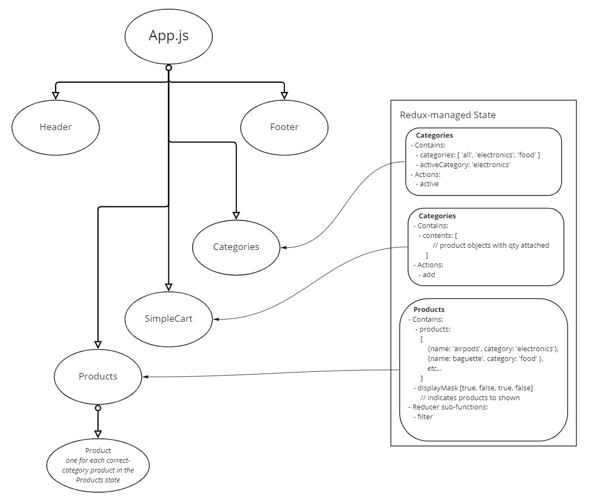
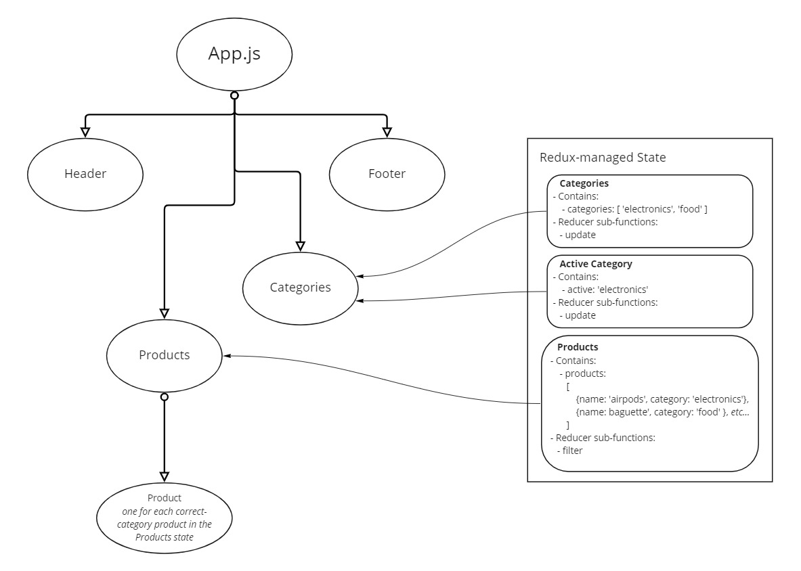

# Virtual Store

An online shopping portal for a fictional store.

## Features

- Displays a list of products based on a category selected by the user.
- Uses React-Redux to manage state for the product list, category list, and active category.

## UML

## Previous UMLs

### v1 (Lab 36)

